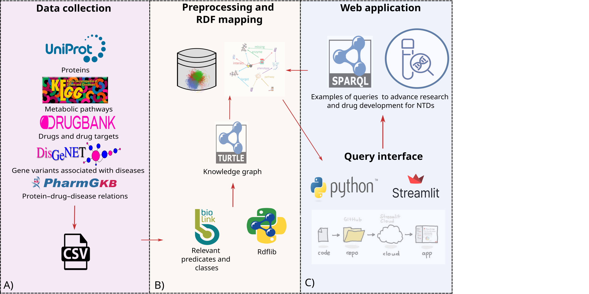
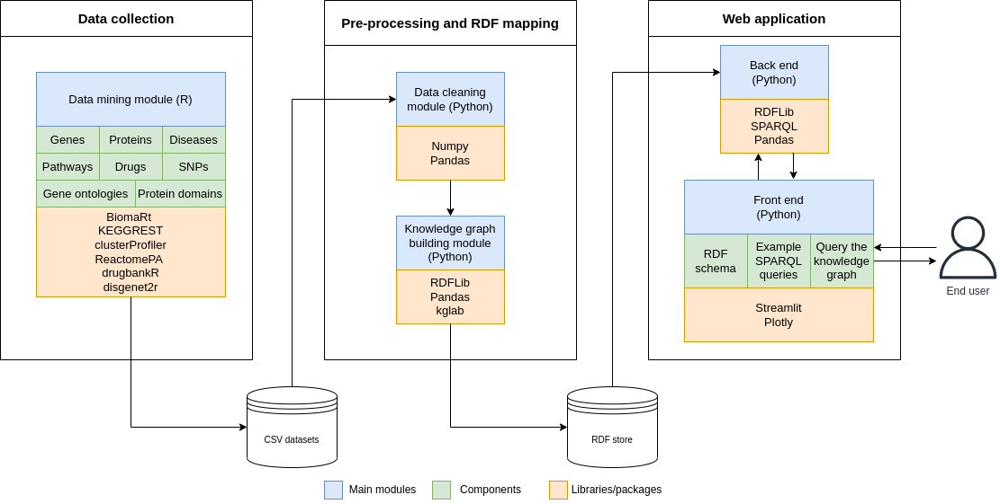
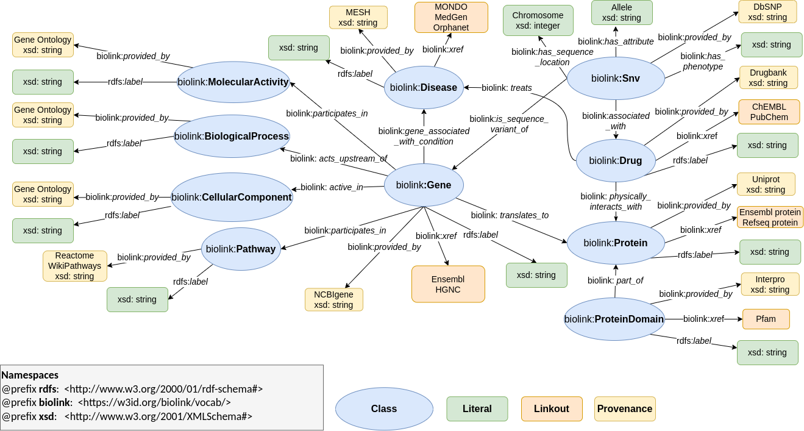

<h1 align="center">
    NTDs2RDF
</h1>

<p align="center">
    <a href="https://github.com/sayalaruano/NTDs2RDF/blob/main/LICENSE.md">
        
    </a>
    <a href="https://doi.org/10.5281/zenodo.7772555">
        
    </a>
    <a href="https://NTDs2RDF.streamlit.app/" title="NTDs2RDF"></a>
</p>

<p align="center">
   A heterogeneous and integrated knowledge graph for the exploration of neglected tropical diseases
</p>

## Table of contents:

- [About the project](#about-the-project)
- [How to run the web app locally?](#how-to-run-this-app-locally)
- [Structure of the repository](#structure-of-the-repository)
- [Credits](#credits)
- [Further details](#details)
- [Contact](#contact)

## About the project

[Neglected tropical diseases (NTDs)][ntds] are a **heterogeneous group of 20 bacterial, viral, parasitic, and fungal conditions** that generally occur in **developing tropical countries** in the Americas, Africa, and Asia. NTDs mainly affect poor populations that do not have access to safe water, sanitation, and high-quality healthcare. Because of the severe effects of NTDs (i.e., they can cause long-lasting disabilities), they **reinforce the cycle of poverty**  in vulnerable communities.

Currently, there are several independent databases that contain information about proteins, metabolic pathways, and drugs involved in NTDs, but no integrated databases with all the information. This **unified resource** could enable the **systematic exploration of all the components of the NTDs**, contributing to the research of potential therapies for these diseases.

The **NTDs2RDF** project aimed  to create **a knowledge graph (KG) of genes, proteins, metabolic pathways, gene ontologies, single nucleotide variants, drugs**, and other relevant data for **three NTDs (Chagas disease, leishmaniasis, and African trypanosomiasis)**, integrating all the information in a single data structure that can be explored through a query interface implemented with a [Streamlit][streamlit] **web application**. This software provides a user-friendly platform to extract information from the KG using **SPARQL queries**.

An overview of the workflow of this project is shown in the graphical abstract below.

<p align="center">
  
  <br>
  <em>Figure 1. Graphical abstract of the NTDs2RDF workflow.</em>
</p>

The project represents an initial step towards the creation of a heterogeneous database for different NTDs with several potential applications in advancing the understanding of NTDs biology and  providing insights that cannot be obtained through  alternative resources.

This project was divided into **various modules for data collection, data cleaning, programmatic creation of the KG, and the development of a web application** for querying the RDF graph. The **software architecture** of all the parts of the NTDs2RDF project is presented in the figure below.

<p align="center">
  
  <br>
  <em>Figure 2. Software architecture of the NTDs2RDF project. The workflow was divided into three main stages with some modules (blue
rectangles) and components (green rectangles).</em>
</p>

## Knowledge graph 

The NTDs2RDF KG has **ten classes and 33.892 triplets**. The [Biolink][biolink] model was the main source to define classes and predicates of 
the **RDF graph** because it has many **human-readable and domain-specific** predicates for Biology, and its entities also follow a 
**machine-readable format** and they are integrated with other ontologies using **semantic mappings**, which makes the KGs **interoperable**.

To assure that all the entities of the KG have standardized and stable identifiers, the [Bioregistry][bioregistry] metaregistry was used to assign 
the URIs and CURIEs. The figure below shows the meta-graph of the NTDs2RDF KG with all the classes and predicates from the Biolink Model and other standard ontologies. 

<p align="center">
  
  <br>
  <em>Figure 3. Meta-graph of the NTDs2RDF KG. The classes are represented as blue ovals, the literals as green rounded rectangles, the
references to external databases as orange rounded rectangles, and the provenance for the classes as yellow rounded rectangles.</em>
</p>

## Web application

To guarantee the **accessibility and findability** of the NTDs2RDF KG, a **multi-page Streamlit web application** was
developed. This software was divided into three pages: **Meta-graph** with all the classes and predicates
from the **Biolink** model and other standard ontologies, **examples of SPARQL queries** to extract relevant information from 
the graph, and the **query interface**. The web application is available online at the link below, and it can also be run locally 
by following the instructions in the next section.

<a href="https://NTDs2RDF.streamlit.app/" title="NTDs2RDF"></a><br>


## How to run the web app locally?

I used [Pipenv][pipenv] to create a Python virtual environment, which allows the management of python libraries and their dependencies. Each Pipenv virtual environment has a `Pipfile` with the names and versions of libraries installed in the virtual environment, and a `Pipfile.lock`, a JSON file that contains versions of libraries and their dependencies.

To create a Python virtual environment with libraries and dependencies required for this project, you should clone this GitHub repository, open a terminal, move to the folder containing this repository, and run the following commands:

```bash
# Install pipenv
$ pip install pipenv

# Create the Python virtual environment 
$ pipenv install

# Activate the Python virtual environment 
$ pipenv shell
```

You can find a detailed guide on how to use pipenv [here][pipenv-guide].

Alternatively, you can create a conda virtual environment with the required libraries using the `requirements.txt` file.

After installing the libraries, you can run the streamlit app locally with the command below:

```bash
$ streamlit run 🏠_Home.py
```

## Structure of the repository

The main files and directories of this repository are:

|File|Description|
|:-:|---|
|[RDF_graph_building.ipynb](RDF_graph_building.ipynb)|Jupyter notebook to integrate the data and create the RDF graph|
| [NTDs2RDF_report.pdf][manuscript] | Full research report and biological/technical discussion |
|[🏠_Home.py](🏠_Home.py)|Script for the home page of the streamlit web application|
|[sparql_queries_NTDs_RDF_examples.txt](sparql_queries_NTDs_RDF_examples.txt)|Examples of SPARQL queries to retrive information from the RDF graph|
|[requirements.txt](requirements.txt)|File with names of the libraries required for the streamlit web application|
|[Pipfile](Pipfile)|File with names and versions of libraries installed in the virtual environment|
|[Pipfile.lock](Pipfile.lock)|Json file that contains versions of libraries and their dependencies|
|[style.css](style.css)|css file to customize style features of the web application|
|[Data/](Data/)|Raw csv files and RDF graph|
|[pages/](pages/)|Python scripts for the pages of the streamlit web application|
|[Data_processing/](Data_processing/)|R scripts to collect the data|
|[img/](img/)|images and gifs|

## Credits

- Developed by [Sebastián Ayala Ruano][my-webpage]. I created this app for a project of a course about knowledge graphs 
from the [MSc in Systems Biology][sysbio] at [Maastricht University][maasuni].

- Part of the code for this project was inspired by the [Medium blogpost][medium-blogpost] and 
[GitHub repo][rdf-github-repo] from [Edoardo Bianchi][edoardo-bianchi] about this topic.

## Further details

The [PDF Manuscript][manuscript] contains more background information on NTDs, a detailed description of the methodology, creation of the 
RDF graph, and the web application, as well as a discussion of the limitations and potential applications of this project.

## Contact

If you have comments or suggestions about this project, you can [open an issue][issues] in this repository.

[ntds]: https://www.who.int/news-room/questions-and-answers/item/neglected-tropical-diseases
[streamlit]: https://streamlit.io/
[biolink]: https://biolink.github.io/biolink-model/
[bioregistry]: https://bioregistry.io/
[pipenv]: https://pipenv.pypa.io/en/latest/
[pipenv-guide]: https://realpython.com/pipenv-guide/
[my-webpage]: https://sayalaruano.github.io/
[sysbio]: https://www.maastrichtuniversity.nl/education/master/masters-programmes
[maasuni]: https://www.maastrichtuniversity.nl/
[medium-blogpost]: https://python.plainenglish.io/linked-data-a-framework-for-large-scale-database-integration-d20628021d4a
[rdf-github-repo]: https://github.com/EdoWhite/ThemeParkAccidents_RDF-SPARQL
[edoardo-bianchi]: https://medium.com/@edoardobianchi98
[manuscript]: NTDs2RDF_report.pdf
[issues]: https://github.com/sayalaruano/NTDs2RDF/issues/new
